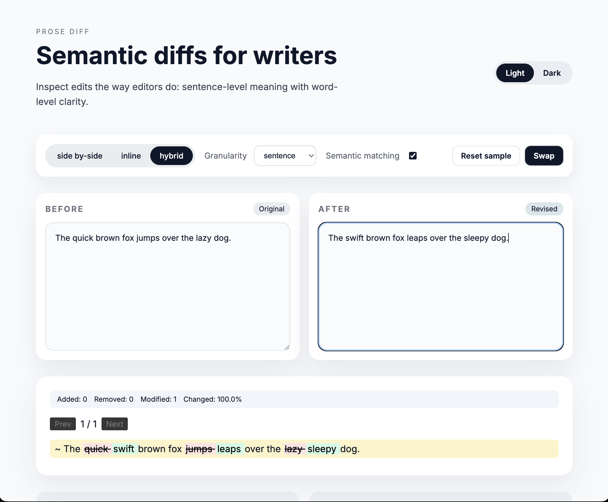
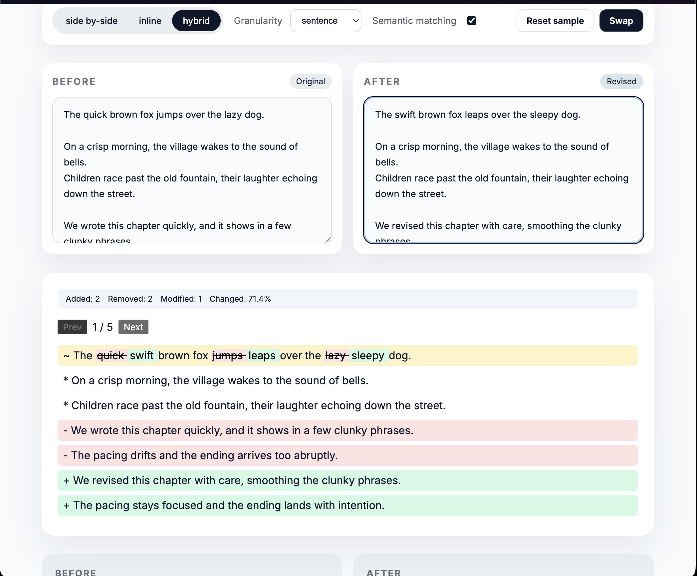

# Prose Diff




Semantic diff viewer for prose. Compare text like an editor: sentence-level meaning with word-level clarity.

## Features

- Sentence/paragraph diffing with word-level highlights
- Side-by-side, inline, and hybrid views
- Semantic matching for rephrased content
- Change stats and navigation
- Three-way merge UI
- Yjs + ProseMirror adapters
- HTML/PDF export helpers

## Getting Started

```bash
npm install
```

### Run the demo app

```bash
npm run dev
```

### Run tests

```bash
npm test
```

### Storybook

```bash
npm run storybook
```

## Usage

```tsx
import { DiffViewer } from "prose-diff";

export function Example() {
  return (
    <DiffViewer
      before="Hello world."
      after="Hello wonderful world."
      mode="inline"
      showStats
    />
  );
}
```

## API

Core:

- `diffDocuments(before, after, options)`
- `parseDocument(text, options)`
- `merge3(base, left, right)`

Utilities:

- `diffAsync(before, after)`
- `exportDiffHtml(result)`
- `exportDiffPdf(result)`

## Project Structure

- `src/core/*` diff engine, parsing, and merge logic
- `src/components/*` React UI components
- `src/integrations/*` Yjs/ProseMirror adapters
- `src/demo/*` demo app
- `tests/*` unit, integration, and visual tests

## License

MIT
